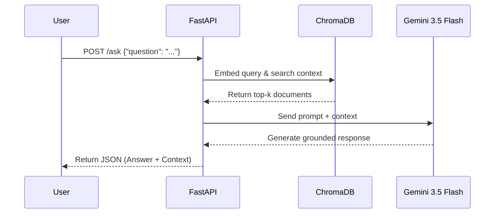

# RAG Gemini FastAPI 🚀

This project implements a modular RAG (Retrieval-Augmented Generation) system exposed through a REST API. It uses local vector databases and Google's latest models (Gemini) to answer technical questions strictly based on indexed documentation.

## 🛠️ Tech Stack
* **Web Framework:** FastAPI (with Pydantic for data validation).
* **Vector Store:** ChromaDB (persistent local environment).
* **Embeddings:** `gemini-embedding-2` model via the new `google-genai` SDK.
* **LLM (Generation):** `gemini-3.5-flash-lite`.
* **Dependency Management:** Modern `pyproject.toml`.

## 📂 Project Structure
```text
rag-gemini-fastapi/
├── data/                  # Source documents for ingestion (ignored by git)
├── chroma_db/             # Local vector database persistence
├── src/
│   ├── __init__.py
│   ├── vector_store.py    # ChromaDB logic and Embeddings generation
│   ├── generator.py       # Interaction with Gemini API
│   └── main.py            # FastAPI application and endpoints
├── app.py                 # Streamlit interactive frontend UI
├── ingestar_pdf.py        # PDF extraction and chunking module (PyMuPDF)
├── Dockerfile             # Container build instructions
├── docker-compose.yml     # Multi-container orchestration setup
├── .env.example           # Template for environment variables
├── pyproject.toml         # Dependencies and metadata
└── README.md              # Project documentation
```

## ⚙️ Architecture



**Ingestion:** Technical documents are converted into vector representations (embeddings) and stored in ChromaDB.

**Retrieval:** Upon receiving an HTTP POST /ask request, the query is vectorized to retrieve the most relevant context via semantic search.

**Generation:** A strict prompt is built injecting the retrieved context, allowing Gemini to generate a natural language response without hallucinating external information.

## Getting Started

### Prerequisites
* Python 3.11 or higher

* A Google AI Studio API Key: [Get one here](https://aistudio.google.com/)

## 🚀 Installation & Execution

#### You can run this project using either Docker (recommended) or a manual local setup.

### Option A: Using Docker (Recommended)

#### With Docker installed, you can spin up both the backend and frontend simultaneously with a single command:

```Bash
docker-compose up --build
```
Access the UI at http://localhost:8501.
---
### Option B: Manual Local Setup
#### If you prefer running the services directly on your machine, activate your virtual environment and run the following commands in two separate terminals.

### Clone the repository:

```Bash
git clone https://github.com/josequispealaya/rag-gemini-fastapi.git

cd rag-gemini-fastapi
```

### Create a virtual environment and install dependencies in editable mode:

```Bash
python3 -m venv venv
source venv/bin/activate
pip install -e .
```

### Configure environment variables:

Copy the example file and add your Google AI Studio API Key.

```Bash
cp .env.example .env
```

### 1. Start the **Backend** local server: (Terminal 1):

```Bash
uvicorn src.main:app --reload
```
The FastAPI backend will be available at http://127.0.0.1:8000.
Test the API: Open your browser at http://127.0.0.1:8000/docs to interact with the Swagger UI interface and test the provided examples.

### 2. Start the **Frontend** (Terminal 2):

```Bash
streamlit run app.py
```
The Streamlit interface will automatically open in your browser at http://localhost:8501.


